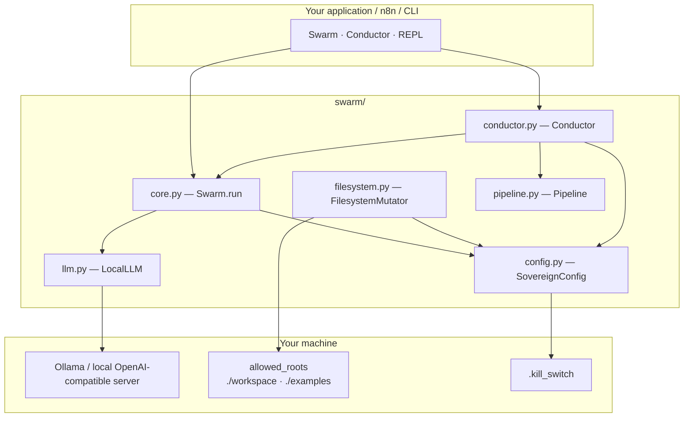
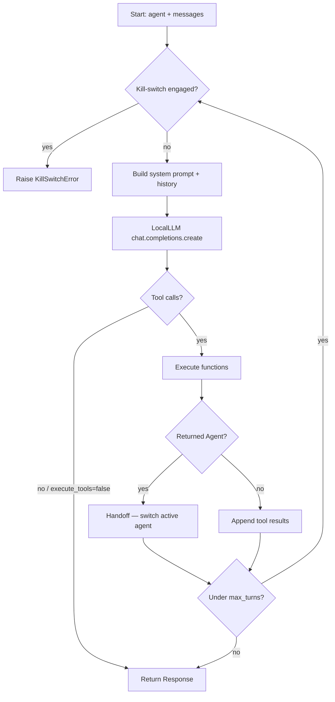
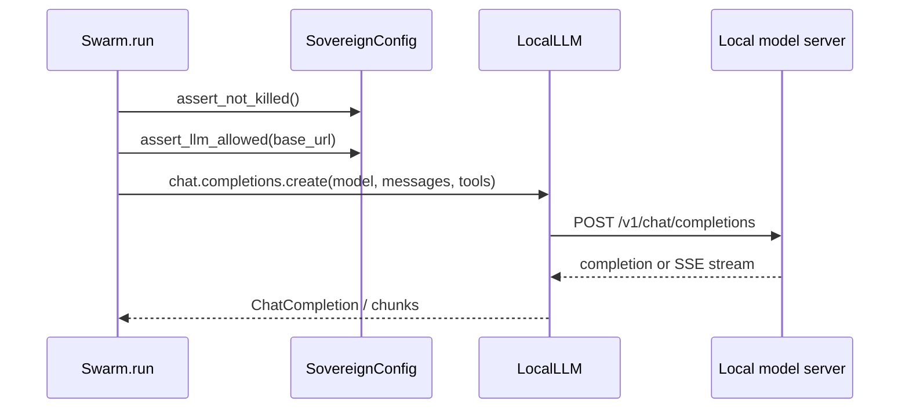
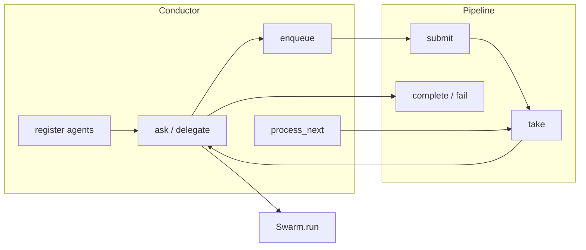
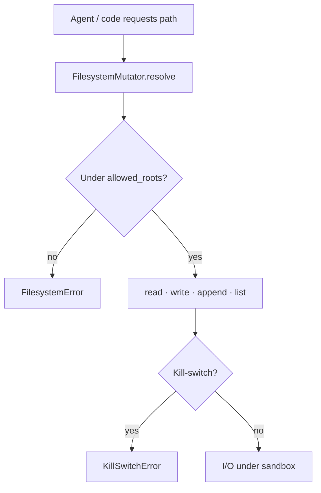
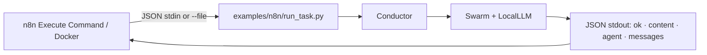

# Swarm Sovereign

Local-first multi-agent orchestration that keeps inference, state, and files on your machine.

Same lightweight `Swarm` / `Agent` API as the original Swarm project — rebuilt for offline use, privacy controls, and clean embedding into automation tools like n8n.

**Maintained by MatteBlackStudios**

---

## Why Swarm Sovereign Exists

The original Swarm project proved that multi-agent systems can stay small: agents, tools, and handoffs — nothing more. That ergonomics story is excellent.

What it did not prioritize was **sovereignty**:

- Inference that never leaves your network by default
- A hard stop (kill-switch) when something goes wrong
- A filesystem sandbox so agents cannot roam the disk
- A turn ceiling so loops cannot run forever
- A thin orchestration layer for pipelines and workflow runners

Swarm Sovereign keeps the public API familiar, then adds only the controls required to run agents as infrastructure you own.

---

## What’s Different

| Upstream Swarm | Swarm Sovereign |
|----------------|-----------------|
| Cloud chat-completions client | Local Ollama-compatible HTTP client (`LocalLLM`) |
| Heavy SDK surface (`openai` + extras) | Runtime dependency: `pydantic` only |
| Unbounded client-side runs | Sovereign ceiling: privacy gate, kill-switch, `max_turns` |
| Handoffs as the only coordination primitive | Handoffs **plus** `Pipeline`, `Conductor`, and `FilesystemMutator` |
| Designed around hosted APIs | Designed for air-gapped / LAN-only model servers |

You still write:

```python
from swarm import Swarm, Agent
```

---

## Sovereign Doctrine

Five rules define the runtime:

| Doctrine | Meaning |
|----------|---------|
| **Privacy first** | `allow_cloud: false` blocks non-local LLM URLs |
| **Offline-capable** | Default endpoint is `http://127.0.0.1:11434/v1` (Ollama-style) |
| **Kill-switch** | Create `.kill_switch` to halt runs and filesystem ops immediately |
| **Allowed-roots sandbox** | `FilesystemMutator` may only touch configured directories |
| **Turn ceiling** | `max_turns` caps `Swarm.run(...)` so agent loops stay bounded |

These are enforced in code — not documented as suggestions.

---

## Architecture Overview



---

## Agent Lifecycle (`Swarm.run`)



---

## LocalLLM Request Flow



Defaults:

- Base URL: `http://127.0.0.1:11434/v1`
- Model: `llama3.2`
- Env overrides: `SWARM_LLM_BASE_URL`, `SWARM_LLM_MODEL`

No cloud SDK. Plain HTTP via the standard library.

---

## Pipeline + Conductor Orchestration



- **Pipeline** — in-memory task queue for agent ↔ agent (or n8n node ↔ node) handoff
- **Conductor** — named registry, shared history/context, optional pipeline drain
- Handoffs inside `Swarm.run` still work; Conductor sits **above** them

---

## Filesystem Sandbox Model



Delete is **off** unless you construct with `allow_delete=True`.

---

## n8n Workflow Bridge



---

## Quickstart

### 1. Install

Python 3.10+

```shell
pip install -e ".[dev]"
```

### 2. Start a local model server

```shell
ollama serve
ollama pull llama3.2
```

### 3. Run your first agent

```python
from swarm import Swarm, Agent

client = Swarm()

agent = Agent(
    name="Agent",
    instructions="You are a helpful agent.",
)

response = client.run(
    agent=agent,
    messages=[{"role": "user", "content": "Hi!"}],
)
print(response.messages[-1]["content"])
```

Handoffs, tools, and `context_variables` behave like upstream Swarm.

### Interactive REPL

```python
from swarm import Agent
from swarm.repl import run_demo_loop

run_demo_loop(Agent(instructions="You are a helpful agent."))
```

### Configuration

`sovereign.yaml` (repo root) or path in `SOVEREIGN_CONFIG`:

```yaml
allow_cloud: false
kill_switch: true
kill_switch_path: .kill_switch
default_model: llama3.2
llm_base_url: http://127.0.0.1:11434/v1
max_turns: 20
allowed_roots:
  - ./workspace
  - ./examples
```

```python
from swarm import load_config

cfg = load_config()
cfg.assert_llm_allowed(cfg.llm_base_url)  # blocks cloud URLs when allow_cloud is false
cfg.assert_not_killed()                   # raises if .kill_switch exists
```

| Rule | Behavior |
|------|----------|
| `allow_cloud: false` | Non-local LLM URLs raise `CloudForbiddenError` |
| Kill-switch | Create `.kill_switch` to halt `Swarm.run` / Conductor / filesystem ops |
| `max_turns` | Ceiling applied to `client.run(...)` |
| `allowed_roots` | Sandbox for `FilesystemMutator` |

Env overrides: `SWARM_LLM_BASE_URL`, `SWARM_LLM_MODEL`, `SOVEREIGN_CONFIG`, `SOVEREIGN_ALLOW_CLOUD`, `SOVEREIGN_KILL_SWITCH`, `SOVEREIGN_MAX_TURNS`.

---

## Modules Overview

### `LocalLLM` (`swarm/llm.py`)

Ollama-compatible client with an OpenAI-shaped surface:

`client.chat.completions.create(...)`

Used automatically by `Swarm()`. Supports streaming SSE. Includes `MockLocalLLM` for offline tests.

### `SovereignConfig` (`swarm/config.py`)

Loads defaults → YAML → environment. Enforces privacy URL checks, kill-switch, turn ceiling, and allowed roots.

```python
from swarm import SovereignConfig, load_config
```

### `FilesystemMutator` (`swarm/filesystem.py`)

Safe `read` / `write` / `append` / `list` under `allowed_roots`.

```python
from swarm import FilesystemMutator

fs = FilesystemMutator()
fs.write("workspace/out.txt", "hello")
print(fs.read("workspace/out.txt"))
```

Agent tool wrappers: `tool_read_file`, `tool_write_file`, `tool_list_dir`.

### `Pipeline` (`swarm/pipeline.py`)

In-memory task queue:

```python
from swarm import Pipeline

pipe = Pipeline()
pipe.submit({"job": "summarize"}, from_agent="intake", to_agent="writer")
task = pipe.take(agent="writer")
pipe.complete(task.id, result="done")
```

### `Conductor` (`swarm/conductor.py`)

Named agents, shared history/context, pipeline drain:

```python
from swarm import Agent, Conductor

conductor = Conductor()
conductor.register(Agent(name="Writer", instructions="Be concise."), activate=True)
response = conductor.ask("Summarize sovereignty in one sentence.")
print(response.messages[-1]["content"])
```

---

## Security Model

| Control | What it protects |
|---------|------------------|
| **Privacy gate** | `LocalLLM` / config refuse non-local base URLs unless `allow_cloud: true` |
| **Kill-switch** | Presence of `.kill_switch` aborts Swarm, Conductor, and filesystem operations |
| **Turn ceiling** | `max_turns` bounds multi-step agent loops |
| **Path sandbox** | Filesystem access cannot escape `allowed_roots` (traversal blocked) |
| **Delete policy** | Destructive deletes disabled by default |

This is a **local trust boundary**, not a multi-tenant security product. Treat `allow_cloud`, `allowed_roots`, and kill-switch paths as production controls.

See `SECURITY.md` for the short policy summary.

---

## Real Use Cases

### Multi-agent handoff desk

Triage agent routes to specialist agents via function returns (`Agent` / `Result`) — same pattern as upstream Swarm, against a local model.

### Conductor + Pipeline factory line

Intake agent acknowledges work → `enqueue` to Writer → `process_next` drains the queue — see `examples/sovereign/conductor_pipeline.py`.

### Local file-aware agent

Bind `FilesystemMutator` tools so an agent can write/read only under `./workspace` — see `examples/sovereign/filesystem_agent.py`.

### n8n / Docker automation

Pass JSON into `examples/n8n/run_task.py`, get JSON back for the next workflow node:

```shell
echo '{"message":"Say hello in five words.","agent":"Agent"}' \
  | python examples/n8n/run_task.py
```

```shell
python examples/n8n/run_task.py --file examples/n8n/sample_payload.json
```

Success shape:

```json
{
  "ok": true,
  "content": "...",
  "agent": "Agent",
  "messages": [],
  "context_variables": {},
  "state": {"active_agent": "Agent", "agents": ["Agent"]}
}
```

Details: `examples/n8n/README.md`.

---

## Try It Now

```shell
# install + local model
pip install -e ".[dev]"
ollama serve
ollama pull llama3.2

# upstream-style basics
python examples/basic/bare_minimum.py
python examples/basic/function_calling.py
python examples/basic/agent_handoff.py
python examples/basic/repl_demo.py

# sovereign modules
python examples/sovereign/conductor_pipeline.py
python examples/sovereign/filesystem_agent.py

# n8n bridge smoke test
python examples/n8n/run_task.py --file examples/n8n/sample_payload.json

# test suite (mocked LLM — no network required)
pytest -q
```

| Path | Purpose |
|------|---------|
| `examples/basic/` | Familiar Swarm API demos + REPL |
| `examples/sovereign/` | Conductor, Pipeline, FilesystemMutator |
| `examples/n8n/` | JSON workflow bridge |

Kill-switch drill: `touch .kill_switch` to halt — `rm .kill_switch` to resume.

---

## Project Layout

```text
OpenAISwarmSovereign/
├── swarm/
│   ├── core.py           # Swarm.run — public API loop
│   ├── types.py          # Agent, Response, Result
│   ├── llm.py            # LocalLLM + MockLocalLLM
│   ├── config.py         # SovereignConfig + load_config
│   ├── filesystem.py     # FilesystemMutator sandbox
│   ├── pipeline.py       # Task queue
│   ├── conductor.py      # Registry + delegation
│   ├── util.py           # function_to_json, streaming helpers
│   └── repl/             # Interactive demo loop
├── examples/
│   ├── basic/            # API-compatible demos
│   ├── sovereign/        # Conductor / Pipeline / filesystem
│   └── n8n/              # JSON stdin/stdout bridge
├── tests/                # Offline unit tests
├── workspace/            # Default sandbox root (.gitkeep)
├── sovereign.yaml        # Privacy + kill-switch defaults
├── pyproject.toml
├── setup.cfg
└── README.md
```

---

## Tests

```shell
pip install -e ".[dev]"
pytest -q
```

---

## License

MIT — derived from the original Swarm project. See `LICENSE`.

This repository is an independent fork. It is **not** affiliated with, endorsed by, or sponsored by the upstream authors’ organizations.

---

**Maintained by MatteBlackStudios**
